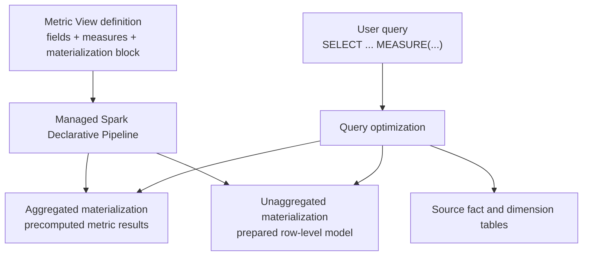

## Materialization Architecture: What Happens Behind the Scenes

Before looking at exact match, rollup match, and fallback behavior, it is worth understanding what Databricks creates when you add materialization to a Metric View.

The key idea is this:

> You still define and query one Metric View. Databricks manages the physical acceleration behind that Metric View.

When you add a `materialization:` block to a Metric View, Databricks creates a managed Spark Declarative Pipeline behind the scenes. That pipeline is responsible for computing and refreshing the materialized data.

The materialized data is not something users are expected to query as a separate business object. It is managed together with the Metric View. Users continue to query the Metric View with `MEASURE(...)`, and query optimization decides whether to read from:

- an aggregated materialization,
- an unaggregated materialization,
- or the original source tables.

Conceptually, the flow looks like this:



This is different from manually creating aggregate tables. With manual aggregate tables, users or dashboard authors need to know which physical table to query. With Metric View materialization, users keep querying the same semantic object.

## Defining Materialization in a Metric View

Materialization is defined inside the Metric View YAML:

```yaml
materialization:
  schedule: every 6 hours
  mode: relaxed
  materialized_views:
    - name: semantic_snapshot
      type: unaggregated

    - name: month_region_product_account
      type: aggregated
      dimensions:
        - fiscal_year
        - fiscal_month
        - region
        - product_family
        - account_category
      measures:
        - revenue
        - cogs
        - opex
```

There are three important pieces here.

### `schedule`

The `schedule` controls how often Databricks refreshes the materializations.

In this example:

```yaml
schedule: every 6 hours
```

That means the managed pipeline refreshes the materialized data every six hours.

### `mode`

The mode is currently:

```yaml
mode: relaxed
```

In relaxed mode, query rewrite checks whether a materialization has the fields and measures needed to answer the query. It does not guarantee that every query sees the freshest possible source data. If a query uses a materialization, it uses the latest successful refresh for that materialization.

This is why materialization design should consider data freshness. For example, if the source pipeline updates daily, schedule the Metric View materialization after that source update completes.

### `materialized_views`

This is the list of physical acceleration structures Databricks should maintain for the Metric View.

Each entry has:

- `name`: a logical name for the materialization.
- `type`: either `aggregated` or `unaggregated`.
- `dimensions`: for aggregated materializations, the grouping fields to precompute.
- `measures`: for aggregated materializations, the measures to precompute.

## Unaggregated Materialization

An unaggregated materialization stores the prepared row-level model.

In this example:

```yaml
- name: semantic_snapshot
  type: unaggregated
```

This materializes the Metric View source after the model has applied source preparation such as:

- fact-to-dimension joins,
- field expressions,
- filters,
- reusable row-level context.

It does **not** pre-aggregate the metrics.

Use an unaggregated materialization when:

- the Metric View has expensive joins,
- the source model has expensive transformations,
- query shapes are unpredictable,
- or you want many query shapes to read from the same prepared snapshot.

In this demo, `semantic_snapshot` is useful for a query such as:

```sql
SELECT
  fiscal_year,
  fiscal_month,
  region,
  MEASURE(unique_customers) AS unique_customers
FROM mat_finance_metric_view_materialized
WHERE fiscal_year = 2025
GROUP BY ALL;
```

`unique_customers` is a distinct count. It cannot safely roll up from an aggregated materialization, but it can still use the unaggregated prepared snapshot.

## Aggregated Materialization

An aggregated materialization stores precomputed metric results at a selected grain.

In this example:

```yaml
- name: month_region_product_account
  type: aggregated
  dimensions:
    - fiscal_year
    - fiscal_month
    - region
    - product_family
    - account_category
  measures:
    - revenue
    - cogs
    - opex
```

This precomputes revenue, COGS, and Opex by:

```text
fiscal_year + fiscal_month + region + product_family + account_category
```

Use an aggregated materialization when:

- the dashboard repeatedly queries the same dimensions,
- the query can be served from a known grain,
- the measures are additive,
- and the materialized grain can also serve useful rollups.

For example, this query is an exact match:

```sql
SELECT
  fiscal_year,
  fiscal_month,
  region,
  product_family,
  account_category,
  MEASURE(revenue) AS revenue
FROM mat_finance_metric_view_materialized
WHERE fiscal_year = 2025
GROUP BY ALL;
```

This query is a rollup match:

```sql
SELECT
  fiscal_year,
  fiscal_month,
  region,
  MEASURE(revenue) AS revenue
FROM mat_finance_metric_view_materialized
WHERE fiscal_year = 2025
GROUP BY ALL;
```

The second query asks for fewer dimensions. Because `revenue` is additive, Databricks can read the more detailed materialization and aggregate it to the requested grain.

## How to Think About the Two Types

| Type | Stores | Best for |
|---|---|---|
| `unaggregated` | Prepared row-level model after joins and fields | Expensive source preparation, varied query shapes, non-additive measures |
| `aggregated` | Precomputed metric results at a chosen grain | Repeated dashboard queries, additive measures, exact and rollup matches |

The two types are complementary.

In practice, a strong materialization design often uses both:

- an unaggregated materialization as the broad fallback path,
- and one or more aggregated materializations for the most common dashboard grains.
